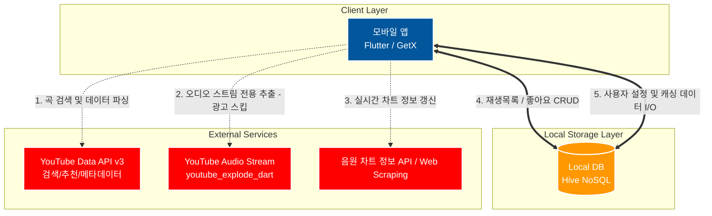
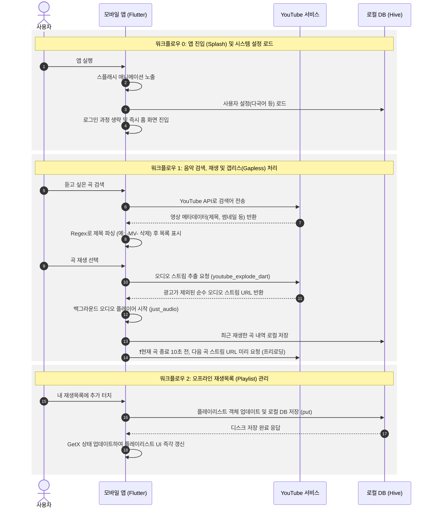

# 어플리케이션 시스템 아키텍처 및 워크플로우

본 문서는 Flutter 어플리케이션(Client), 로컬 데이터베이스(Hive), 외부 서비스(YouTube) 간의 시스템 아키텍처 및 핵심 워크플로우를 나타내는 플로우 차트(Sequence Diagram 및 Architecture Graph)를 포함합니다. 서버 없이 전면 오프라인/로컬 스토리지 기반으로 작동하는 서버리스(Serverless) 구조입니다.

## 1. 시스템 아키텍처 구성도 (System Architecture)

어플리케이션(Client), 로컬 데이터베이스(Local DB), 외부 서비스 간의 관계를 보여주는 전체 아키텍처 맵입니다.

---

## 2. 어플리케이션 핵심 워크플로우 (Workflow Sequence Diagram)

사용자의 행동(음악 검색, 재생, 플레이리스트 저장)에 따른 앱 내부, 로컬 스토리지, 외부 시스템 간의 데이터 흐름을 상세하게 나타냅니다.

