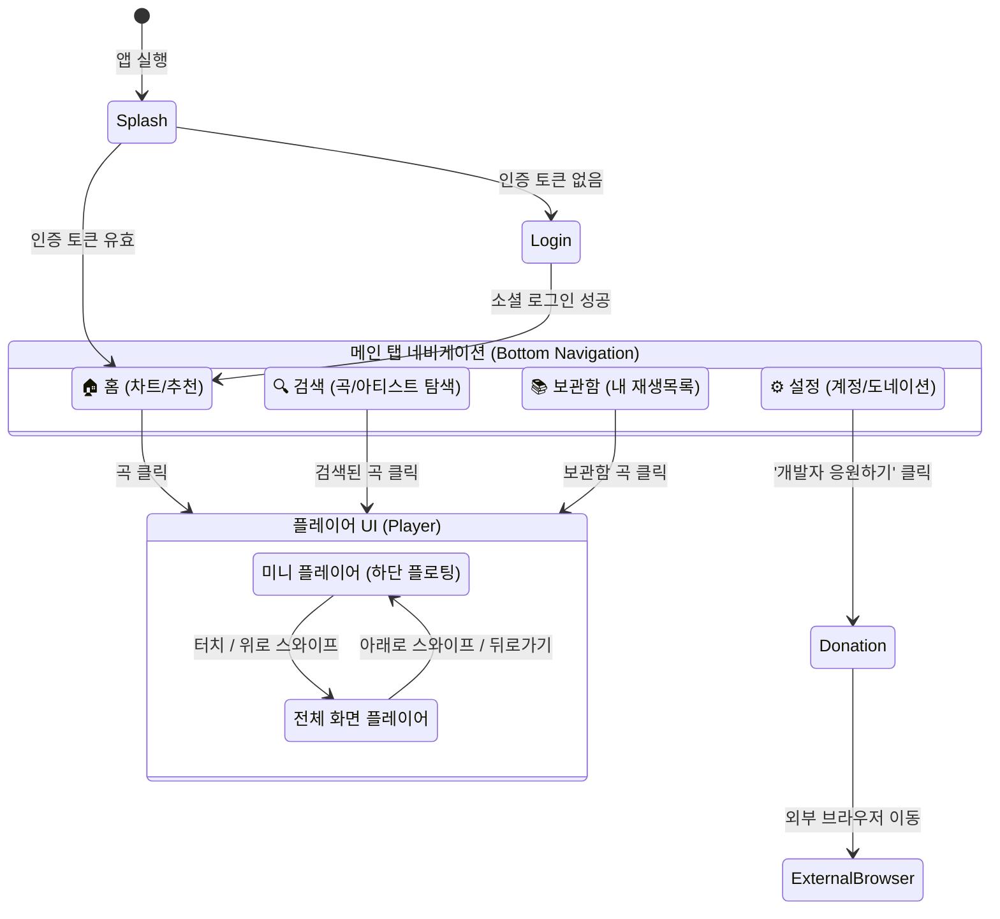
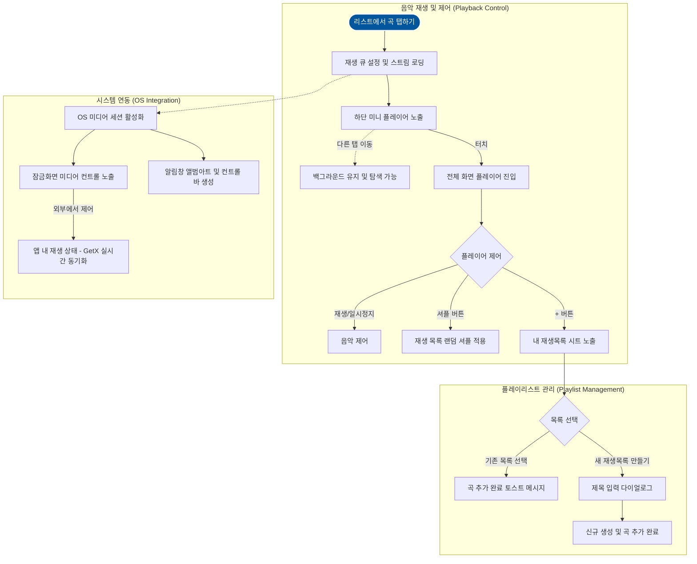

# 사용자 어플리케이션 워크플로우 (User Application Workflow)

본 문서는 사용자가 모바일 앱(Android/iOS)을 실행하고 조작할 때 경험하게 되는 **화면 전환 및 인터랙션 중심의 프론트엔드 워크플로우**를 정리한 문서입니다.

---

## 1. 화면 전환 플로우 (Screen Navigation Flow)

사용자가 앱을 실행한 시점부터 주요 메뉴 간의 이동 및 플레이어 화면 진입 과정을 나타냅니다.

---

## 2. 세부 사용자 상호작용 (User Interaction) 흐름

---

## 3. 화면별 주요 요구사항 및 UX 포인트

### A. 앱 진입 및 메인
* **스플래시 화면**: 로컬 스토리지에 저장된 JWT를 확인하여 즉각적인 자동 로그인을 수행합니다. 지연을 최소화하기 위해 애니메이션 직후 전환됩니다.
* **로그인 화면**: 복잡한 입력 폼 없이 구글, 애플 로고가 박힌 소셜 로그인 버튼 두 개만 배치하여 진입 장벽을 낮춥니다.
* **홈 화면**: 최상단에 일간 인기 차트를 가로 스크롤(Carousel)로 제공하고, 하단에는 유저의 최근 재생 기반 맞춤 추천 곡을 나열합니다.

### B. 탐색 (검색 및 보관함)
* **검색 화면**: 사용자가 타이핑하는 즉시(Debounce 적용) 유튜브 연동 검색 결과를 실시간으로 노출합니다. 정규식 파싱을 거쳐 텍스트가 깔끔한 곡들만 리스트에 렌더링합니다.
* **보관함**: 카드가 겹쳐 있는 듯한 UI로 플레이리스트들을 나열하고, 썸네일은 리스트에 담긴 곡들의 앨범 아트를 4분할 콜라주 형태로 조합해 제공합니다.

### C. 플레이어 및 갭리스(Gapless) 경험
* **플로팅 미니 플레이어**: 유튜브 뮤직이나 벅스처럼 앱 내 어떤 화면을 탐색하든 탭바 상단에 항상 재생 컨트롤이 떠 있어 접근성이 뛰어납니다.
* **전체 화면 전환**: 앨범 이미지가 커지면서 전환되는 `Hero Animation`을 사용하여 고급스러운 시각적 경험을 제공합니다.
* **무중단 백그라운드 재생**: 다른 앱을 켜거나 폰 화면을 껐을 때(OS 백그라운드 전환), 잠금 화면과 알림 센터를 통해 네이티브 음악 앱과 동일하게 컨트롤이 가능합니다. 재생이 끝나기 10초 전에 다음 곡을 버퍼링(Pre-loading)하여 트랙 간 끊김(Gap)을 제거합니다.
